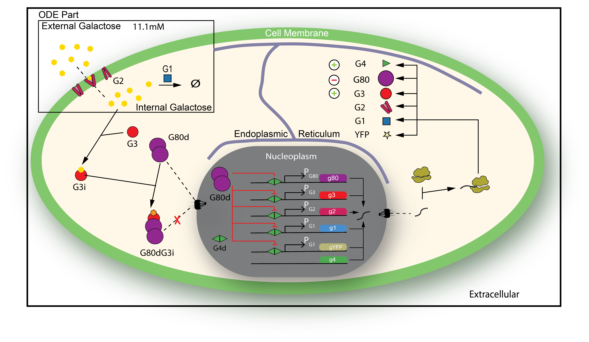
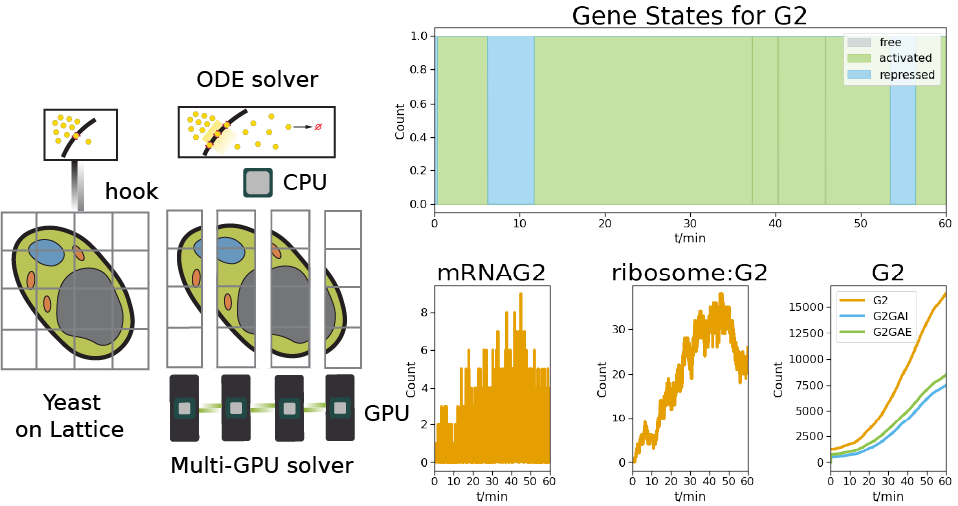
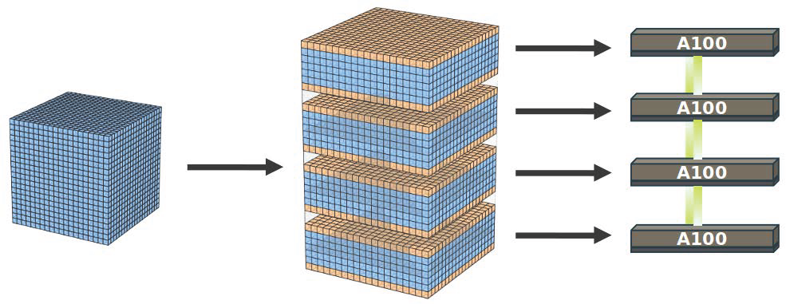

# Yeast Galactose Switch: Hybrid RDME-ODE Simulation Framework

[](LICENSE)


This repository contains the computational framework for simulating yeast galactose switch dynamics using hybrid reaction-diffusion master equation (RDME) and chemical master equation (CME) approaches coupled with ordinary differential equations (ODE). The work demonstrates multi-scale spatial-temporal modeling of gene regulatory networks in realistic cellular geometries.


*Figure 1: Schematic of the yeast galactose switch system showing the hybrid RDME-ODE approach with spatial cellular compartments and gene regulatory network*

## Overview

The galactose switch in *Saccharomyces cerevisiae* represents a paradigmatic example of bistable gene expression. This framework implements:

- **Hybrid RDME-ODE simulations** for spatial modeling of molecular transport and gene regulation
- **Hybrid CME-ODE simulations** for well-mixed compartment modeling  
- **Multi-GPU acceleration** for large-scale spatial simulations
- **Realistic cellular geometries** derived from electron microscopy data
- **Multi-scale temporal dynamics** from seconds to hours


*Figure 2: Multi-scale computational approach showing yeast cell geometry, gene states, and molecular dynamics across different time scales*

## Key Features

### Multi-Scale Modeling
- **Spatial RDME**: Captures molecular diffusion and localization effects
- **Well-mixed CME**: Efficient simulation of fast molecular interactions
- **ODE coupling**: Handles continuous variables like galactose transport

### High-Performance Computing
- **Multi-GPU support** for large-scale spatial simulations
- **MPI parallelization** for distributed computing
- **Optimized CUDA kernels** for reaction-diffusion dynamics


*Figure 3: Multi-GPU parallelization strategy for spatial domain decomposition*

### Realistic Cellular Geometry
- High-resolution electron microscopy-derived geometries
- Detailed subcellular compartments (nucleus, ER, cytoplasm)
- Ribosome distributions and membrane structures

## Repository Structure

```
├── Lattice-Microbes_YeastRDMEODE/    # Core simulation engine
│   ├── src/                          # C++/CUDA source code
│   ├── pylm-examples/               # Python examples
│   └── docs/                        # Documentation
├── cmeode/                          # Hybrid CME-ODE simulations
│   ├── cme_ode_sim.py              # Main simulation script
│   ├── cme_rxns/                   # Reaction definitions
│   └── analysis/                   # Analysis notebooks
├── rdmeode/                         # Hybrid RDME-ODE simulations
│   ├── main_code/                  # Main simulation scripts
│   ├── geometry/                   # Cellular geometry files
│   ├── init_counts/                # Initial conditions
│   └── analysis/                   # Analysis notebooks
├── figures/                         # Key figures for documentation
└── README.md                        # This file
```

## Installation

### Prerequisites

- **Anaconda/Miniconda**: For Python environment management
- **CUDA Toolkit** (≥11.0): For GPU acceleration
- **GCC/G++** (≥7.0): For C++ compilation
- **CMake** (≥3.12): For build system
- **HDF5**: For data storage

### System Requirements

- **CPU**: Multi-core processor (≥8 cores recommended)
- **GPU**: NVIDIA GPU with CUDA support (≥8GB VRAM for large simulations)
- **RAM**: ≥16GB for large-scale simulations
- **Storage**: ≥20GB free space for simulation data

### Installation Steps

1. **Clone the repository**:
```bash
git clone https://github.com/your-repo/Yeast_Galactose_Switch_RDMEODE.git
cd Yeast_Galactose_Switch_RDMEODE
```

2. **Install Lattice Microbes**:
```bash
cd Lattice-Microbes_YeastRDMEODE

# Create and activate conda environment
conda env create -n lm2.5_dev conda_envs/lm_precomp.yml
conda activate lm2.5_dev

# Build Lattice Microbes
mkdir build && cd build
cmake ../src/ -D MPD_GLOBAL_T_MATRIX=True -D MPD_GLOBAL_R_MATRIX=True
make -j$(nproc) && make install
```

3. **Set up CUDA environment** (if using GPUs):
```bash
export PATH="/usr/local/cuda/bin/:$PATH"
export LD_LIBRARY_PATH="/usr/local/cuda/lib64:$LD_LIBRARY_PATH"
```

4. **Verify installation**:
```bash
lm --version
python -c "import pyLM; print('pyLM installed successfully')"
```

## Usage

### Running CME-ODE Simulations

For well-mixed compartment simulations:

```bash
cd cmeode
bash ode_cme.sh
```

**Key parameters**:
- `GAE_CONC`: External galactose concentration (mM)
- `NUM_REPS`: Number of simulation replicates
- `SIM_TIME`: Simulation duration (minutes)

### Running RDME-ODE Simulations

For spatial simulations with cellular geometry:

```bash
cd rdmeode/main_code
bash ode_rdme.sh
```

**Configuration options**:
- **Geometry**: Choose from normal, ER-enriched, or effective ribosome geometries
- **GPU settings**: Adjust number of GPUs and memory allocation
- **Simulation parameters**: Set time steps, species counts, and output frequency

### Analysis

Comprehensive analysis notebooks are provided:

- **CME-ODE Analysis**: `cmeode/analysis/yeast_ode_cme_analysis.ipynb`
- **RDME-ODE Analysis**: `rdmeode/analysis/rdmeode-analysis_new.ipynb`
- **Comparative Analysis**: Various notebooks for comparing different approaches


## Contributing

We welcome contributions! Please see our contributing guidelines:

1. Fork the repository
2. Create a feature branch
3. Make your changes with appropriate tests
4. Submit a pull request


## License

This project is licensed under the Apache License - see the [LICENSE](LICENSE) file for details.

## Support

For questions and support:
- **Issues**: Report bugs and request features via GitHub Issues
- **Documentation**: See `docs/` directory for detailed documentation


---

*This computational framework enables quantitative understanding of gene regulatory dynamics in realistic cellular environments, bridging molecular mechanisms and cellular behavior.*